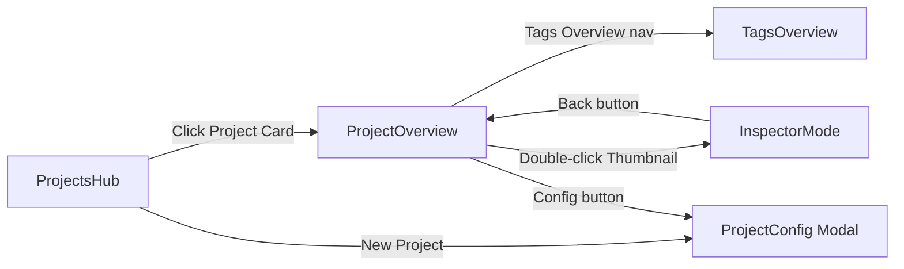
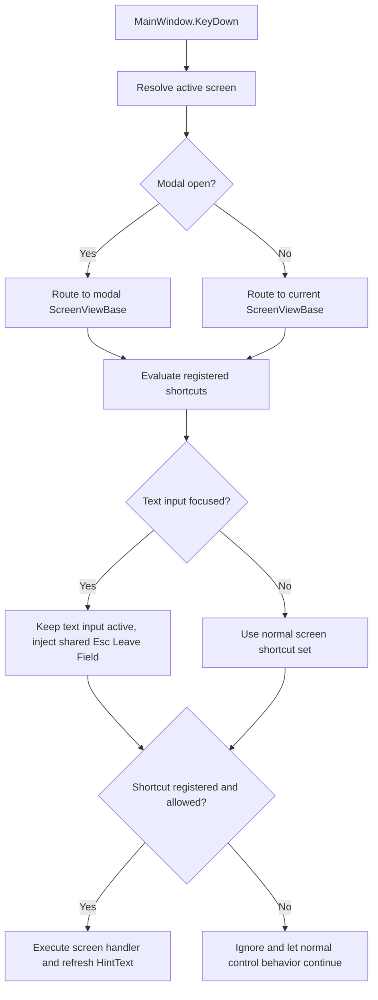
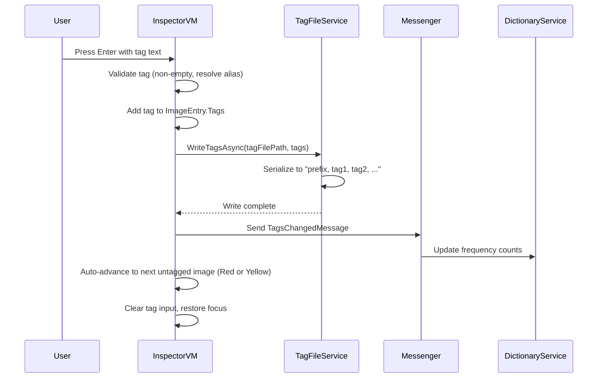
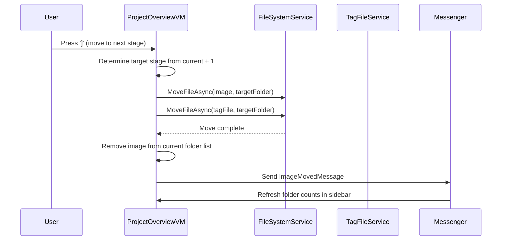
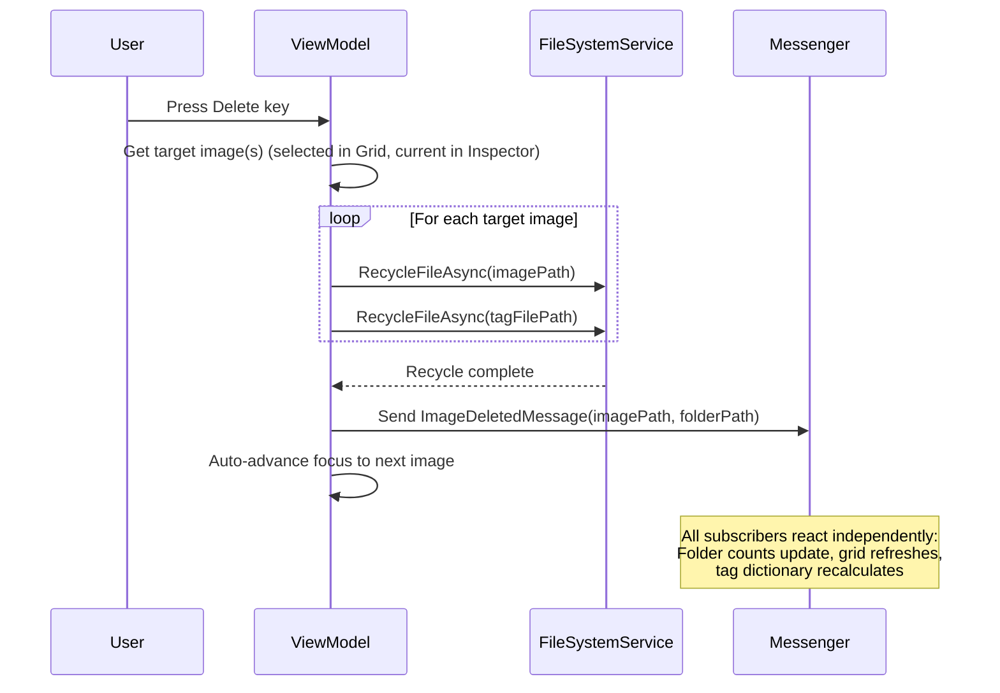

# Design Document: DatasetStudio

## Authority Note

The files under `.kiro/specs/DatasetStudio/` are the authoritative source for DatasetStudio requirements, design, and implementation planning. Files under `design reference/` are illustrative only and may show older directions or incomplete mockups. If there is any conflict, the `.kiro` documents win.

## Overview

DatasetStudio is a keyboard-first Avalonia/XAML (C#, .NET 10) desktop application for curating and tagging image datasets used in AI training. The application follows the MVVM (Model-View-ViewModel) pattern native to Avalonia, with a service layer handling file system operations, AI model integration, and tag parsing. The visual identity uses the Gruvbox Light palette with IBM Plex Sans/Mono typography and a retro-utilitarian aesthetic with hard 2px border radiuses.

The application consists of five screens: Projects Hub (entry point), Project Overview (batch operations), Inspector Mode (sequential tagging), Project Configuration (modal settings), and Tags Overview (taxonomy management). All screens share a persistent Hint Bar for keyboard shortcuts. Data is stored entirely on the local file system — projects map to physical folders, tags live in Booru-style `.txt` sidecar files, and configuration is persisted as JSON.

## Architecture

### MVVM Pattern

DatasetStudio uses Avalonia's native MVVM architecture with CommunityToolkit.Mvvm for source-generated observable properties and relay commands.

**Strict MVVM Rules:**
- All observable properties MUST use `[ObservableProperty]` attribute for source generation. Manual `INotifyPropertyChanged` is prohibited where the attribute applies.
- Data flow is strictly: Model → ViewModel → View for updates, View → ViewModel → Model for commands. Models NEVER interact with Views.
- All service operations performing I/O (file system, AI inference, JSON) MUST be `async Task`. No synchronous blocking calls on the UI thread.
- View code-behind contains ONLY view-specific logic (focus management, animation triggers). All business logic lives in ViewModels and Services.

```
┌─────────────────────────────────────────────────────────┐
│                      Views (XAML)                        │
│  ProjectsHubView │ ProjectOverviewView │ InspectorModeView  │
│  ProjectConfigView │ TagsOverviewView                    │
├─────────────────────────────────────────────────────────┤
│                   ViewModels (C#)                        │
│  ProjectsHubVM │ ProjectOverviewVM │ InspectorModeVM         │
│  ProjectConfigVM │ TagsOverviewVM │ MainWindowVM          │
├─────────────────────────────────────────────────────────┤
│                   Services (C#)                          │
│  IFileSystemService │ ITagFileService │ IAiTaggerService  │
│  IProjectService │ ITagDictionaryService                 │
│  IKeyboardRouter │ INavigationService │ IClipboardService │
│  IStatePersistenceService │ IThumbnailCacheService        │
├─────────────────────────────────────────────────────────┤
│                   Models (C#)                            │
│  Project │ ImageEntry │ Tag │ WorkflowStage              │
│  TagDictionaryEntry │ ProjectConfiguration               │
└─────────────────────────────────────────────────────────┘
```

### Dependency Injection

Services are registered in a DI container (Microsoft.Extensions.DependencyInjection) at application startup and injected into ViewModels via constructor injection.

### Navigation

Screen navigation is managed by a `NavigationService` that swaps the `ContentControl` in `MainWindow`. The active ViewModel is exposed as `MainWindowVM.CurrentView`. The Project Configuration modal is rendered as an overlay `Panel` within `MainWindow`, toggled by `MainWindowVM.IsConfigOpen`.



## Event-Driven Architecture

All cross-component communication MUST flow through the CommunityToolkit.Mvvm `IMessenger`. This is a hard architectural rule — ViewModels never call methods on other ViewModels directly.

**Screen-Agnostic Messages** — All messages are general-purpose and contain no screen-specific logic:

```csharp
// Image lifecycle
public record ImageMovedMessage(string ImagePath, string SourceFolder, string TargetFolder);
public record ImageDeletedMessage(string ImagePath, string FolderPath);
public record ImageSelectionChangedMessage(string ImagePath, bool IsSelected);

// Tag lifecycle
public record TagsChangedMessage(string ImagePath, IReadOnlyList<string> NewTags);
public record TagDictionaryChangedMessage(string ProjectId);

// Workflow
public record WorkflowStageChangedMessage(string ProjectId, string FolderPath);
public record ProjectOpenedMessage(string ProjectId);

// AI
public record AiTaggingCompletedMessage(string ImagePath, IReadOnlyList<string> GeneratedTags);

// State
public record ProjectConfigSavedMessage(string ProjectId);
```

**Side Effects Rule** — All side effects (refreshing folder counts, updating status dots, recalculating tag frequencies, updating progress bars) MUST occur as reactions to messenger events or through Avalonia data binding. Side effects MUST NEVER be performed by directly manipulating View elements from code-behind or ViewModel logic. When a ViewModel receives a message, it updates its own observable properties, and the View reacts through binding. This is the ONLY permitted pattern.

**Example flow:**
1. `ProjectOverviewVM` moves an image → publishes `ImageMovedMessage`
2. `ProjectOverviewVM` (sidebar section) subscribes → updates folder counts via its own `[ObservableProperty]`
3. `InspectorModeVM` subscribes → refreshes if the moved image was current
4. The View updates automatically through Avalonia data binding — no imperative View manipulation

## Components and Interfaces

### Screen Component Hierarchy

> **Reference Sketches:** Conceptual screen layouts are available in `design reference/*/screen.png`. These are rough, non-authoritative sketches showing the general layout idea only. They do not override `.kiro/specs/DatasetStudio/`, their colors do not reflect the final Gruvbox Light palette, and some visual elements may be missing or incomplete. The implementation must produce fully working screens based on the `.kiro` requirements and component hierarchies below, not pixel-perfect reproductions of the sketches.

#### MainWindow

```
MainWindow
├── TopBar (64px, shared across screens)
│   ├── AppLogo + Title ("DatasetStudio")
│   └── Screen-specific controls (injected per ViewModel)
├── ContentArea (swapped by NavigationService)
│   ├── ProjectsHubView
│   ├── ProjectOverviewView
│   ├── InspectorModeView
│   └── TagsOverviewView
├── ProjectConfigOverlay (modal, toggled visibility)
└── HintBar (24px, context-sensitive keyboard shortcuts)
```

#### ProjectsHubView
```
ProjectsHubView
├── TopBar
│   ├── MasterRootDirectoryPicker (TextBox + Browse Button)
│   └── NewProjectButton
├── ProjectCardGrid (ItemsControl with WrapPanel)
│   ├── ProjectCard[] (name, path, image count, progress bar)
│   └── EmptyStatePlaceholder (dashed border, centered text)
└── HintBar
```

#### ProjectOverviewView
```
ProjectOverviewView
├── TopBar (64px)
│   ├── ProjectName (TextBlock, 18px IBM Plex Sans 600)
│   ├── AiModelDropdown (ComboBox)
│   └── QuickFilterBar (TextBox, IBM Plex Mono)
├── ThreeColumnLayout
│   ├── LeftSidebar (240px)
│   │   └── WorkflowStageList (ListBox of folder items with image counts)
│   ├── CenterGrid (fluid)
│   │   ├── GridToolbar (folder name, item count, status legend)
│   │   ├── ImageGrid (ItemsControl with WrapPanel, min 160px cells)
│   │   │   └── ThumbnailItem[] (1:1 crop, StatusDot, hover checkbox)
│   │   ├── EmptyFolderPlaceholder
│   │   └── ZoomSlider (Slider, 100-400px, bottom-right)
│   └── BatchPopups (Popup controls)
│       ├── BatchAddPopup (autocomplete, triggered by '+')
│       └── BatchRemovePopup (tag list with frequencies, triggered by '-')
├── HintBar
└── StatusBar (feedback messages, contextual info)
```

#### InspectorModeView
```
InspectorModeView
├── TopBar (64px, image identifier + status badge)
├── ThreeColumnLayout
│   ├── LeftSidebar (240px, WorkflowStageList — shared component)
│   ├── CenterPane (fluid)
│   │   └── ImageViewer (Viewbox, preserves aspect ratio)
│   └── RightSidebar (320px)
│       ├── PrefixTagsBlock (read-only, IBM Plex Mono, Surface Elevated bg)
│       ├── TagInput (32px TextBox, persistent focus, auto-suggest Popup)
│       └── AppliedTagsList (WrapPanel of TagPill controls)
├── HintBar
└── StatusBar
```

#### TagsOverviewView
```
TagsOverviewView
├── TopBar (search/filter bar + "New Tag" button)
├── CenterPane (fluid)
│   └── TagDataGrid (DataGrid with sortable columns)
│       ├── Column: Tag Name (IBM Plex Mono)
│       ├── Column: Frequency
│       ├── Column: Alias
│       └── Column: Actions (Edit, Merge, Delete)
├── HintBar
└── StatusBar
```

### Shared Components

| Component | Description |
|---|---|
| `WorkflowStageList` | Reusable ListBox showing workflow folders with stripped numeric prefixes and image counts. Used in ProjectOverview and InspectorMode sidebars. |
| `HintBar` | 24px-height bar displaying context-sensitive keyboard shortcuts in monospace. Content bound to current ViewModel's `HintText` property. |
| `StatusBar` | 24px-height bar at the bottom of every screen for displaying feedback messages and contextual status information. Display only, no input. |
| `TagPill` | Inline control: `Border` containing tag text (IBM Plex Mono) + `x` remove button. Background `#EBDBB2`, border `1px solid #D5C4A1`. |
| `StatusDot` | 12px circle overlay on thumbnails. Color bound to `ImageEntry.TagStatus` enum (Red/Yellow/Green). |
| `ActiveFocusFrame` | 2px solid Warning `#D79921` border applied to the currently focused/active item. Used on thumbnails in Project Overview and image preview in Inspector Mode. Bound to `IsFocused` or `IsActive` property on the ViewModel item. |
| `BatchPopup` | Popup with TextBox + ListBox for autocomplete tag selection. Shared template, parameterized for add vs. remove mode. |

### Service Interfaces

```csharp
public interface IFileSystemService
{
    Task<IReadOnlyList<string>> DiscoverProjectFoldersAsync(string masterRootPath);
    Task<IReadOnlyList<string>> GetImageFilesAsync(string folderPath);
    Task MoveFileAsync(string sourcePath, string destinationFolder);
    Task RecycleFileAsync(string filePath); // Send to OS recycle bin
    Task EnsureFolderExistsAsync(string folderPath);
    // Watches project root for external changes (files added/removed/renamed outside the app).
    // Used to auto-refresh image lists and folder structure when changes are detected.
    FileSystemWatcher WatchFolder(string folderPath);
}

public interface IThumbnailCacheService
{
    Task<Stream> GetThumbnailAsync(string imageFilePath, int size);
    Task InvalidateAsync(string imageFilePath);
    Task InvalidateFolderAsync(string folderPath);
}

public interface ITagFileService
{
    Task<IReadOnlyList<string>> ReadTagsAsync(string tagFilePath);
    Task WriteTagsAsync(string tagFilePath, IReadOnlyList<string> tags);
    Task<IReadOnlyList<string>> ReadTagsWithPrefixAsync(string tagFilePath, IReadOnlyList<string> prefixTags);
    string GetTagFilePath(string imageFilePath); // same base name, .txt extension
    bool TagFileExists(string imageFilePath);
}

public interface IAiTaggerService
{
    Task<IReadOnlyList<string>> GenerateTagsAsync(string imageFilePath, string modelName);
    bool TryQueueTagGeneration(Project project, string imageFilePath);
    Task<IReadOnlyList<AiModelInfo>> GetAvailableModelsAsync();
    Task<AiModelInfo?> DownloadModelAsync(string modelId, CancellationToken cancellationToken = default);
    bool IsModelDownloadInProgress(string modelId);
    bool IsProcessing(string imageFilePath);
    event EventHandler<AiTaggingCompletedMessage>? TagGenerationCompleted;
}

public interface IProjectService
{
    Task<IReadOnlyList<Project>> LoadProjectsAsync();
    Task<Project> CreateProjectAsync(string name, string rootFolder);
    Task SaveProjectAsync(Project project);
    Task DeleteProjectAsync(string projectId);
}

public interface ITagDictionaryService
{
    Task<IReadOnlyList<TagDictionaryEntry>> GetAllEntriesAsync(string projectId);
    Task<IReadOnlyList<string>> SearchTagsAsync(string projectId, string query);
    Task RenameTagAsync(string projectId, string oldName, string newName);
    Task MergeTagsAsync(string projectId, string sourceTag, string targetTag);
    Task DeleteTagAsync(string projectId, string tagName, bool removeFromFiles);
    Task AddAliasAsync(string projectId, string canonicalTag, string alias);
    string ResolveAlias(string projectId, string input);
}

public interface INavigationService
{
    void NavigateTo<TViewModel>() where TViewModel : ViewModelBase;
    void NavigateTo<TViewModel>(object parameter) where TViewModel : ViewModelBase;
    void GoBack();
}

public interface IClipboardService
{
    Task CopyTagsAsync(IReadOnlyList<string> tags);
    Task<IReadOnlyList<string>> PasteTagsAsync();
}

public interface IStatePersistenceService
{
    Task SaveAppStateAsync(AppState state);
    Task<AppState> LoadAppStateAsync();
    Task SaveProjectStateAsync(string projectId, ProjectState state);
    Task<ProjectState> LoadProjectStateAsync(string projectId);
}
```

### Keyboard Input Routing Architecture

Keyboard input is centralized in the shell and standardized through a reusable screen base:

1. **Shell-level routing** — `MainWindow` owns the single `KeyDown` entry point and resolves the active rendered screen. Modal content has priority over the underlying main screen.

2. **Screen registration** — Every routable screen derives from `ScreenViewBase<TViewModel>` and overrides a small virtual surface such as `BuildScreenShortcuts()` to declare the shortcuts it is willing to accept for the current screen.

3. **Context filtering** — `ScreenViewBase<TViewModel>` evaluates the current focus context before dispatch. When a `TextBox` has focus, ordinary text entry stays with the control, shared escape behavior is injected automatically, and only explicitly allowed shortcuts remain active.

4. **Shell-facing state** — Screen ViewModels inherit `ScreenViewModelBase`, which narrows the shell-facing contract to `TopBarContent`, `HintText`, and `StatusText`. The base screen computes the active shortcut list and pushes the formatted `HintText` into the current `ScreenViewModelBase`, while `MainWindowViewModel` mirrors whichever screen is currently active.



### Local ONNX Tagging Architecture

The current local tagging path is optimized around WD-style ONNX taggers such as `SmilingWolf/wd-swinv2-tagger-v3`, and the design should be read in DatasetStudio terms rather than the generic external guidance:

0. **Tag as first-class entity** — Across DatasetStudio, a `Tag` is a standalone domain entity with canonical identity, aliases, category semantics, and global usage information. The image-level ONNX payload should be modeled as one or more `ImageTagAssignment` records that connect an `Image`, a `Tag`, and a `Model`, plus score and acceptance metadata.
1. **Catalog and install state** — `AiModelCatalogService` resolves `ai_models.json`, while `HuggingFaceCliService` handles explicit model downloads. `AiTaggerService` only tags with already-installed models; it never installs a model implicitly during background work.
2. **Per-model runtime config** — `AiTaggerService` builds a `TaggerModelConfig` for the selected installed model. For WD-style taggers this requires `model.onnx` plus `selected_tags.csv`, along with DatasetStudio thresholds and batch size settings.
3. **Single long-lived GPU session** — `TaggerSession` owns one long-lived ONNX Runtime `InferenceSession` for the active model. DatasetStudio uses one batching worker in front of that session instead of one process per image or one model load per request.
4. **Batch-first execution** — `TryQueueTagGeneration(...)` and `GenerateTagsAsync(...)` both flow into `TaggerSession`. Jobs are grouped into batches before inference, and batch size tuning happens at the `TaggerModelConfig` level instead of through ad hoc parallel process spawning.
5. **Runtime metadata inspection** — `TaggerSession` reads `session.InputMetadata` and `session.OutputMetadata` at runtime and derives the input layout and output width from the loaded ONNX model. DatasetStudio does not hardcode tensor layout beyond validating that the model is a supported float image tagger.
6. **Image preprocessing** — `ImagePreprocessor` loads images with ImageSharp, composites transparency against white, pads to square, resizes to the ONNX input size, and packs either NHWC or NCHW tensors depending on the metadata discovered at runtime.
7. **Structured tag post-processing** — `TagPostProcessor` loads the WD `selected_tags.csv` label file once per active model, maps output indexes to DatasetStudio tag identity data, applies rating/general/character thresholds, and returns an image-scoped assignment collection. Avoid vague names like `...Result`; the shape should read as what it is, for example `ImageTagAssignments` containing `ImageTagAssignment` items.
8. **Sidecar writing as derived output** — `TagSidecarService` derives flat training tags from the accepted tag assignments in that image-scoped assignment collection, and `AiTaggingCoordinator` writes the `.txt` sidecar only after inference succeeds. Here, a `.txt` sidecar means the companion text file beside an image on disk, for example `image001.png` and `image001.txt`. This is sidecar writing or sidecar persistence, not export to another application.

Relevant implementation constraints from the external tagging guidance, adapted to DatasetStudio:
- Prefer one ONNX Runtime GPU session per active model and one batching worker in front of it.
- Batch many images into one inference call whenever possible.
- Do not reload the model per image.
- Do not spawn one inference process per image.
- Store structured tags internally and derive flat training text only when writing sidecars.
- Treat WD-style ONNX taggers as the supported local runtime path today. Other catalog entries may be downloadable, but they are not inference-compatible until DatasetStudio gains a non-WD post-processing path.
- Normalize around standalone tag entities across the whole app. Services that currently emit image-scoped tag records should evolve toward `Tag` plus `ImageTagAssignment` metadata instead of treating raw strings or per-image score objects as the canonical tag shape.

Key routing rules:
- When a `TextBox` has focus (tag input, filter bar), letter keys are consumed by the TextBox. `Escape` returns focus to the parent container (grid or image viewer).
- The active screen does not receive arbitrary keypresses. It receives only the shortcuts that it registered through `ScreenViewBase<TViewModel>`, which keeps the work surface narrow and consistent across screens.
- `Escape` dismisses any open popup (batch add/remove). If no popup is open in Inspector Mode, `Escape` navigates back to Project Overview.
- In Project Overview, when no TextBox is focused: arrow keys navigate the grid, `x` toggles selection, `+`/`-` open batch popups, `[`/`]` move images, `Delete` recycles images.
- In Inspector Mode, any letter key auto-focuses the tag input (requirement 3.6). Arrow keys navigate images. `[`/`]` move the current image between stages. `Delete` recycles the current image.
- The `HintBar` content updates reactively based on `CurrentScreen` and `IsTextInputFocused` state.

### Keyboard Shortcut Reference Per Screen

Each screen exposes a `HintText` string property on its ViewModel. The `HintBar` displays this text in IBM Plex Mono at the bottom of every screen. The text updates reactively when context changes (e.g., a popup opens, a TextBox gains focus). The exact strings below are the canonical HintBar content for each screen state.

#### Projects Hub

| Key | Action | HintBar Label |
|---|---|---|
| `Enter` | Open selected project | `Enter: Open` |
| `↑` `↓` | Navigate project cards | `↑↓: Navigate` |
| `N` | New project | `N: New Project` |

**HintBar default:** `↑↓: Navigate  Enter: Open  N: New Project`

#### Project Overview — Grid Focused (no TextBox, no popup)

| Key | Action | HintBar Label |
|---|---|---|
| `↑` `↓` `←` `→` | Navigate thumbnails | `←↑↓→: Navigate` |
| `x` | Toggle selection on focused image | `X: Select` |
| `+` | Open Batch Add popup | `+: Batch Add` |
| `-` | Open Batch Remove popup | `-: Batch Remove` |
| `[` | Move selected image(s) to previous stage | `[: Move Prev` |
| `]` | Move selected image(s) to next stage | `]: Move Next` |
| `Alt+[` | Navigate to previous stage folder | `Alt+[: Prev Folder` |
| `Alt+]` | Navigate to next stage folder | `Alt+]: Next Folder` |
| `Delete` | Recycle selected image(s) | `Del: Delete` |
| `/` | Focus Quick Filter bar | `/: Filter` |
| `Enter` or double-click | Open image in Inspector Mode | `Enter: Inspect` |
| `Ctrl+Shift+C` | Copy tag set of focused image | `Ctrl+Shift+C: Copy Tags` |
| `Ctrl+Shift+V` | Paste tag set onto focused image | `Ctrl+Shift+V: Paste Tags` |
| `Escape` | Unfocus TextBox / return to grid | `Esc: Back` |

**HintBar default:** `←↑↓→: Navigate  X: Select  +: Add  -: Remove  []: Move  Del: Delete  /: Filter  Enter: Inspect`

#### Project Overview — Batch Add Popup Open

| Key | Action | HintBar Label |
|---|---|---|
| Type text | Filter/search tags | _(implicit)_ |
| `Enter` | Commit selected tag to batch | `Enter: Apply Tag` |
| `↑` `↓` | Navigate autocomplete suggestions | `↑↓: Navigate` |
| `Escape` | Close popup | `Esc: Cancel` |

**HintBar:** `↑↓: Navigate  Enter: Apply Tag  Esc: Cancel`

#### Project Overview — Batch Remove Popup Open

| Key | Action | HintBar Label |
|---|---|---|
| `↑` `↓` | Navigate tag list | `↑↓: Navigate` |
| `Enter` | Remove selected tag from batch | `Enter: Remove Tag` |
| `Escape` | Close popup | `Esc: Cancel` |

**HintBar:** `↑↓: Navigate  Enter: Remove Tag  Esc: Cancel`

#### Project Overview — Quick Filter Focused

| Key | Action | HintBar Label |
|---|---|---|
| Type text | Filter images by tag content | _(implicit)_ |
| `Escape` | Clear filter and return focus to grid | `Esc: Clear & Back` |

**HintBar:** `Type to filter  Esc: Clear & Back`

#### Inspector Mode — Tag Input Focused (default state)

| Key | Action | HintBar Label |
|---|---|---|
| Type text | Enter tag text (auto-suggest active) | _(implicit)_ |
| `Enter` | Commit tag, auto-advance to next untagged | `Enter: Commit Tag` |
| `↑` `↓` | Navigate auto-suggest dropdown | `↑↓: Suggestions` |
| `Escape` | Navigate back to Project Overview | `Esc: Back to Overview` |

**HintBar:** `Enter: Commit & Next  ↑↓: Suggestions  Esc: Back to Overview`

#### Inspector Mode — Image Navigation (tag input not focused)

| Key | Action | HintBar Label |
|---|---|---|
| `←` | Previous image | `←: Prev Image` |
| `→` | Next image | `→: Next Image` |
| `[` | Move image to previous stage | `[: Move Prev` |
| `]` | Move image to next stage | `]: Move Next` |
| `Delete` | Recycle current image | `Del: Delete` |
| `Ctrl+Shift+C` | Copy tag set | `Ctrl+Shift+C: Copy Tags` |
| `Ctrl+Shift+V` | Paste tag set | `Ctrl+Shift+V: Paste Tags` |
| Any letter | Auto-focus tag input | _(implicit)_ |
| `Escape` | Navigate back to Project Overview | `Esc: Back to Overview` |

**HintBar:** `←→: Navigate  []: Move Stage  Del: Delete  Type: Tag  Esc: Back to Grid`

> **Note:** In Inspector Mode, the tag input has persistent focus by default (requirement 3.6). The "image navigation" state only applies when the user explicitly clicks outside the tag input or when the auto-suggest popup is dismissed. Any letter key immediately re-focuses the tag input.

#### Tags Overview

| Key | Action | HintBar Label |
|---|---|---|
| `/` | Focus search bar | `/: Search` |
| `↑` `↓` | Navigate DataGrid rows | `↑↓: Navigate` |
| `Enter` | Edit selected row (inline) | `Enter: Edit` |
| `Delete` | Delete selected tag | `Del: Delete` |
| `Escape` | Exit edit mode / unfocus search | `Esc: Cancel` |

**HintBar default:** `↑↓: Navigate  /: Search  Enter: Edit  Del: Delete`

#### Project Configuration Modal

| Key | Action | HintBar Label |
|---|---|---|
| `Tab` | Move between form fields | `Tab: Next Field` |
| `Enter` | Save and close (when Save button focused) | `Enter: Save` |
| `Escape` | Cancel and close modal | `Esc: Cancel` |

**HintBar:** `Tab: Next Field  Enter: Save  Esc: Cancel`

AI model selectors in Project Configuration and Project Overview use an explicit companion `Download Model` button placed beside the selector. Hugging Face-backed models are installed only through that button; background tagging never performs model installation implicitly.

### HintBar Implementation Rule

Each screen ViewModel MUST inherit `ScreenViewModelBase`, which provides the shell-facing `HintText` property. Concrete screens SHOULD NOT hard-code keyboard hint strings in constructors. Instead, each screen registers its allowed shortcuts through `ScreenViewBase<TViewModel>`, and the base screen computes the context-sensitive HintBar text (including text-input-focused states such as `Esc Leave Field`) and writes it into the active `ScreenViewModelBase.HintText`. The HintBar control continues to bind to that property and renders it in IBM Plex Mono 12px on a 24px-height bar.

## Data Models

### Core Models

```csharp
public class Project
{
    public string Id { get; set; }              // GUID
    public string Name { get; set; }            // Display name (subfolder name or user-defined)
    public string RootFolderPath { get; set; }  // Absolute path to project root
    public List<WorkflowStage> Stages { get; set; }
    public List<string> PrefixTags { get; set; }
    public string AiModelName { get; set; }     // Selected AI model identifier
    public DateTime LastModified { get; set; }
}

public class WorkflowStage
{
    public int Order { get; set; }              // Parsed from numeric prefix (e.g., "01_Inbox" → 1)
    public string FolderName { get; set; }      // Physical folder name on disk (e.g., "01_Inbox")
    public string DisplayName { get; set; }     // Stripped name (e.g., "Inbox")
}
```

> **Dynamic Folder Ordering:** Workflow stage order is ALWAYS derived at runtime by parsing the numeric prefix from each subfolder name on disk (e.g., `01_` → order 1, `02_` → order 2). The application MUST NOT hardcode or cache folder ordering. This ensures stages can be reordered, added, or removed by simply renaming folders on disk, without requiring code changes. When loading a project, the application scans the root folder, extracts numeric prefixes, sorts by that value, and builds the `WorkflowStage` list dynamically.

```csharp
public class ImageEntry
{
    public string FilePath { get; set; }        // Absolute path to image file
    public string FileName { get; set; }        // File name without extension
    public string TagFilePath { get; set; }     // Companion .txt file path
    public TagStatus Status { get; set; }       // Red, Yellow, Green
    public List<string> Tags { get; set; }      // Current tag list (excluding prefix)
    public bool IsSelected { get; set; }        // Selection state for batch ops
    public bool IsAiProcessing { get; set; }    // True while AI tagger is running
}

public enum TagStatus
{
    Untagged,       // Red — no tag file exists
    AutoTagged,     // Yellow — AI-generated, needs human review
    Ready           // Green — human-reviewed, ready for training
}

public class TagDictionaryEntry
{
    public string CanonicalName { get; set; }   // The primary tag name
    public List<string> Aliases { get; set; }   // Alternative names that resolve to this tag
    public int GlobalFrequency { get; set; }    // Usage count across all project images
}

// Conceptual domain model direction:
// Tag = standalone entity used across the whole application.
// ImageTagAssignment = relationship between an image, a tag, and the model/source that proposed it.
// ImageTagAssignments = collection of image-specific tag assignments, not the tag catalog itself.

public class AiModelInfo
{
    public string Id { get; set; }
    public string DisplayName { get; set; }
    public string ModelPath { get; set; }
}
```

### On-Disk Data Layout

```
MasterRootDirectory/
├── ProjectA/                          ← Project.RootFolderPath
│   ├── .datasetstudio.json            ← Project configuration file
│   ├── .datasetstudio-cache/          ← Thumbnail cache (auto-generated)
│   ├── 01_Inbox/                      ← WorkflowStage folder
│   │   ├── image001.png
│   │   ├── image001.txt               ← Tag file: "tag1, tag2, tag3"
│   │   ├── image002.jpg
│   │   └── image002.txt
│   ├── 02_Review/
│   │   └── ...
│   └── 03_Ready/
│       └── ...
├── ProjectB/
│   ├── .datasetstudio.json
│   └── ...
└── ai_models.json                     ← Shared AI model catalog override (optional)
```

```
%LocalAppData%/DatasetStudio/
├── huggingface/                       ← HF_HOME for Hugging Face auth/cache state
├── models/
│   └── <owner>/<repo>/                ← App-managed downloaded HF model installs
└── tools/
    └── hf-cli/                        ← App-managed `hf` CLI bootstrap (when system `hf` is unavailable)
```

### Tag File Format

Each `.txt` file stores tags as a single line of comma-separated values:

```
tag1, tag2, tag3, another tag
```

When saving, prefix tags are prepended:

```
prefix1, prefix2, tag1, tag2, tag3
```

### Project Configuration File (`.datasetstudio.json`)

```json
{
  "id": "a1b2c3d4-...",
  "name": "Cyberpunk_Cityscapes",
  "stages": [
    { "order": 0, "folderName": "01_Inbox", "displayName": "Inbox" },
    { "order": 1, "folderName": "02_Review", "displayName": "Review" },
    { "order": 2, "folderName": "03_Ready", "displayName": "Ready" }
  ],
  "prefixTags": ["lora_style", "masterpiece", "best quality"],
  "aiModelName": "wd14-vit-v2",
  "state": {
    "activeStageFolderName": "01_Inbox",
    "zoomSliderValue": 160,
    "selectedAiModelName": "wd14-vit-v2",
    "lastInspectedImagePath": null
  }
}
```

### State Management

Each ViewModel holds its own observable state using `CommunityToolkit.Mvvm` `[ObservableProperty]` attributes. Cross-ViewModel communication uses the `IMessenger` (from CommunityToolkit.Mvvm) exclusively — see the Event-Driven Architecture section above for the full message catalog.

### State Persistence

All configurable settings and stateful properties are persisted automatically so the user resumes exactly where they left off on next launch.

**Application-level state** (`datasetstudio-settings.json` in user app data):
```csharp
public class AppState
{
    public string? LastOpenedProjectId { get; set; }
    public double WindowWidth { get; set; }
    public double WindowHeight { get; set; }
    public double WindowX { get; set; }
    public double WindowY { get; set; }
    public string? LastMasterRootDirectory { get; set; }
}
```

**Project-level state** (stored within `.datasetstudio.json`):
```csharp
public class ProjectState
{
    public string? ActiveStageFolderName { get; set; }
    public int ZoomSliderValue { get; set; }
    public string? SelectedAiModelName { get; set; }
    public string? LastInspectedImagePath { get; set; }
}
```

Every property that can be configured or have a state MUST be included in persistence. When adding new stateful properties to any ViewModel, the corresponding persistence model MUST be updated to include them.

State is saved on change (debounced to avoid excessive writes) and loaded at startup before the first View is rendered.

### Supported Image Formats

- Read: PNG (`.png`), JPEG (`.jpg`, `.jpeg`), WebP (`.webp`), BMP (`.bmp`)
- Thumbnails: saved as WebP (`.webp`) in the cache for optimal size

Source images are never converted — they remain in their original format on disk.

The `IFileSystemService.GetImageFilesAsync` filters by these extensions. Any file with a recognized extension in a Workflow_Stage folder is treated as a valid image entry.

### Caching Architecture

**Thumbnail Cache** — Thumbnails are generated on first access and stored in a `.datasetstudio-cache/` subfolder within each project's root folder. Cache keys are derived from the image file path and modification timestamp. When the source image changes (timestamp mismatch), the cached thumbnail is invalidated and regenerated on next access.

```
ProjectA/
├── .datasetstudio-cache/
│   ├── 01_Inbox/
│   │   ├── image001_160.webp    ← cached thumbnail at 160px
│   │   └── image002_160.webp
│   └── 02_Review/
│       └── ...
├── 01_Inbox/
│   ├── image001.png
│   └── ...
```

**In-Memory Caches:**
- Tags Overview — loaded once per project open, with a persisted fingerprinted snapshot stored in the project configuration. At runtime the cache is invalidated on `TagDictionaryChangedMessage`, `TagsChangedMessage`, `AiTaggingCompletedMessage`, `ImageDeletedMessage`, and watcher-originated `TagFilesChangedMessage` events so autocomplete and frequency counts stay current without rescanning tag sidecars on every request.
- Workflow Stage list — parsed from disk on project open, refreshed when `FileSystemWatcher` detects folder structure changes (add/remove/rename subfolders).
- Image file lists per folder — loaded on folder selection, refreshed on `FileSystemWatcher` file events or after move/delete operations.

All cache invalidation flows through the messenger event system — when an `ImageMovedMessage`, `ImageDeletedMessage`, `TagsChangedMessage`, `AiTaggingCompletedMessage`, or `TagFilesChangedMessage` is published, the relevant caches update reactively.

### Data Flow: Tag Commit (Inspector Mode)



### Data Flow: Image Move Between Stages



### Data Flow: Delete to Recycle Bin



### Data Flow: Batch Tag Add


## Error Handling

### File System Errors

| Scenario | Handling |
|---|---|
| Root folder path does not exist | Display error in StatusBar. Disable project loading. Prompt user to reconfigure via Project Configuration. |
| Image file locked/inaccessible during move | Retry once after 500ms. If still locked, display error in StatusBar with file path. Skip the file and continue batch operation. |
| Recycle bin operation fails (file locked, recycle bin full) | Display error in StatusBar with file path. Do not advance focus. Leave image in place. |
| Tag file write fails (permissions, disk full) | Display error in StatusBar. Revert in-memory tag state to last known good state. |
| Tag file missing during read | Treat image as untagged (Red status). Queue for AI tagging if AI tagger is enabled. |
| Master root directory scan fails | Display error in StatusBar. Show empty Projects Hub with placeholder text. |

### AI Tagger Errors

| Scenario | Handling |
|---|---|
| AI model catalog missing or malformed | Fall back to empty model list. Display error in StatusBar. |
| Hugging Face CLI unavailable or bootstrap fails | Display warning in StatusBar. Keep manual tagging available and leave HF-backed models marked as not installed. |
| Selected HF-backed model download fails | Display warning in StatusBar. Leave model uninstalled and allow the user to retry download later. |
| AI model inference fails for an image | Log error. Set image status to Untagged (Red). Skip to next image in queue. Display count of failed images in StatusBar. |

### Data Validation Errors

| Scenario | Handling |
|---|---|
| Prefix tags contain invalid characters | Show red border on textarea + error message below field (requirement 4.5). Prevent save until corrected. |
| Duplicate tag addition | Silently skip the duplicate. No error displayed. |
| Tag merge creates circular alias | Detect cycle before merge. Display error in StatusBar. Abort merge operation. |
| Empty tag input on Enter | Ignore the keypress. Do not commit an empty tag. |

### Graceful Degradation

- If the AI tagger service is unavailable, the application operates fully in manual mode. All tagging features work; only auto-tagging is disabled.
- If a tag file is corrupted (non-parseable), treat the image as untagged and log a warning. Do not overwrite the corrupted file until the user explicitly saves new tags.
- If the `.datasetstudio.json` config file is missing from a project folder, create a default configuration using the folder name as the project name and auto-detecting subfolders as workflow stages.


## Testing Strategy

### Philosophy

Tests serve two purposes in DatasetStudio:

1. **Regression detection** — Catch when an LLM or manual edit breaks core low-level behaviors (config serialization, tag parsing, file operations, state persistence).
2. **TDD guardrails** — Force service logic to be implemented in testable, decoupled classes rather than glued directly into Views or ViewModels. If a behavior can't be tested without spinning up a UI, it's in the wrong layer.

All tests use **NUnit**. No property-based testing libraries. Keep it simple — focused assertions on concrete scenarios.

### What to Test

Tests cover the service layer and pure logic only. No UI tests, no ViewModel tests that require Avalonia runtime.

| Test Class | What It Covers |
|---|---|
| `TagFileServiceTests` | Read/write tag files (round-trip), comma parsing, prefix prepending, path derivation (.txt from image path), empty file handling, whitespace trimming |
| `ProjectConfigServiceTests` | Save/load `.datasetstudio.json` round-trip, all fields preserved (stages, prefix tags, AI model, state block), malformed JSON fallback |
| `AiModelCatalogServiceTests` | Shared `ai_models.json` catalog override, legacy local-model entry compatibility, HF install-state mapping |
| `HuggingFaceCliServiceTests` | System `hf` usage, managed CLI bootstrap fallback, download argument/environment construction |
| `StatePersistenceTests` | App state save/load round-trip (window geometry, last project, last master root), project state save/load (active stage, zoom, last inspected image) |
| `WorkflowStageTests` | Numeric prefix parsing and ordering (`03_Ready`, `01_Inbox`, `02_Review` → sorted correctly), display name stripping, folders without prefixes sorted after numbered ones |
| `TagDictionaryServiceTests` | Add/remove/rename tags, alias resolution, merge updates all references, frequency counting |
| `FileOperationTests` | Move image + tag file together, recycle both files, verify source gone and target exists |
| `BatchOperationTests` | Batch add skips duplicates, batch remove eliminates tag, all other tags preserved |
| `ThumbnailCacheTests` | Cache miss generates thumbnail, cache hit returns cached file, stale cache invalidated on timestamp change |

### Test Organization

```
DatasetStudio.Tests/
├── TagFileServiceTests.cs
├── ProjectConfigServiceTests.cs
├── StatePersistenceTests.cs
├── WorkflowStageTests.cs
├── TagDictionaryServiceTests.cs
├── FileOperationTests.cs
├── BatchOperationTests.cs
└── ThumbnailCacheTests.cs
```

### TDD Rule

When implementing a new service method or behavior, the test MUST be written first. The implementation is then written to make the test pass. This ensures all service logic is exercised through the public interface and never coupled to UI concerns.
